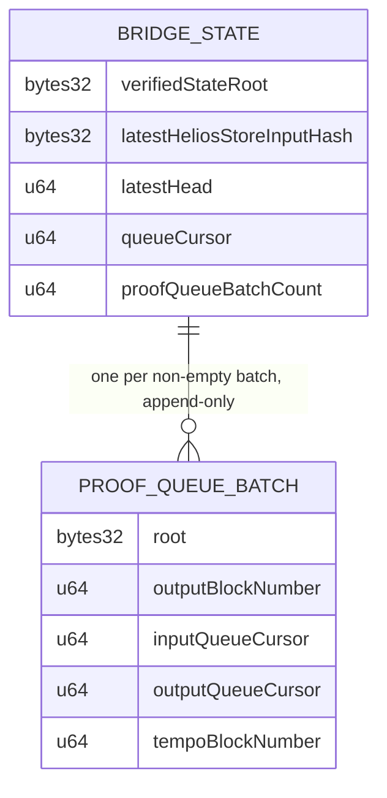
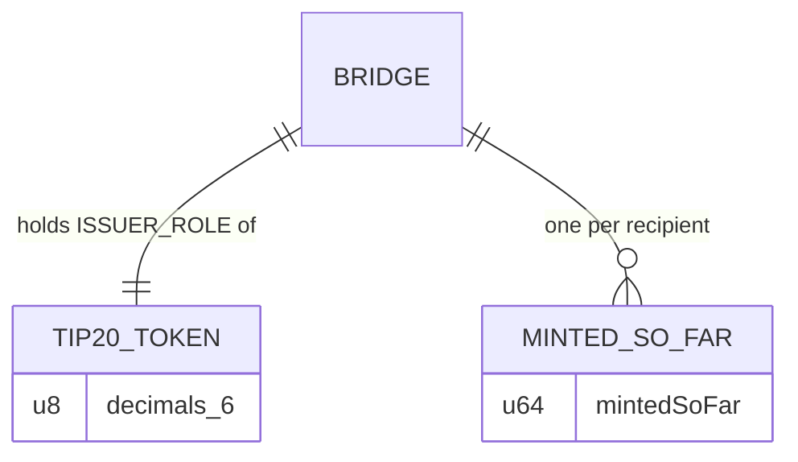
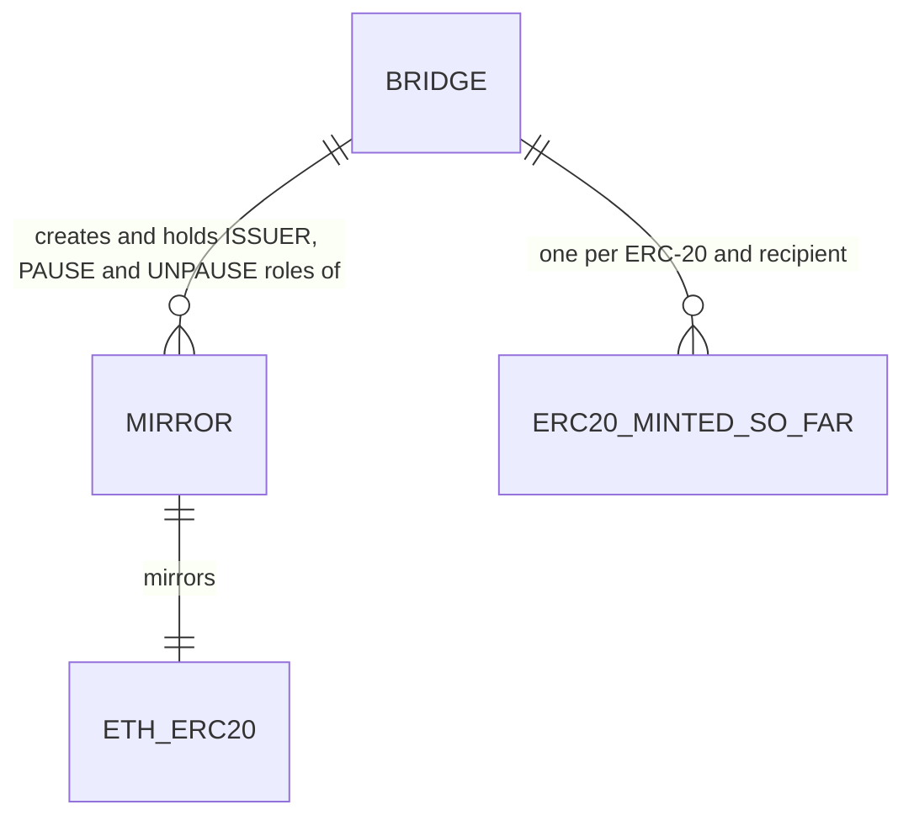

# nori-tempo-sdk

Generic Ethereum→Tempo state bridge. Any Ethereum contract can enqueue a
storage-proof request for one of its own storage slots on the proof request
queue. [nori-bridge-head](https://github.com/Nori-zk/nori-bridge-head), a
Helios light client running in SP1, proves Ethereum consensus and execution
state and folds each batch of drained requests into a Merkle root. The Tempo
bridge contract verifies those SP1 Groth16 proofs on-chain with
sp1-contracts' v6.1.0 Groth16 verifier and commits every batch root, so any
settled request can be proven on Tempo by Merkle witness.

Built on the queue, the token bridge locks ETH on Ethereum and mints the
matching TIP-20 token on Tempo.

## Packages

### `ethereum/` — npm `@nori-zk/ethereum-tempo-bridge`

Ethereum contracts, Hardhat tasks and generated ethers types, plus the
`./iso-provider` Ethereum provider.

- [NoriProofRequestQueue.sol](ethereum/contracts/NoriProofRequestQueue.sol):
  append-only queue of storage-proof requests, drained in order by the SP1
  program. `target` is always `msg.sender`; each request pays
  `proofRequestQueueFee`.
- [NoriTokenBridge.sol](ethereum/contracts/NoriTokenBridge.sol): locks ETH
  (`lockTokens`) and ERC-20s (`lockERC20`) and enqueues a proof request for
  each deposit; `syncPause` copies an ERC-20's `paused()` into the bridge and
  requests a proof of it (see [ERC-20 mirrors](#erc-20-mirrors)).
- [TimeLockController.sol](ethereum/contracts/TimeLockController.sol):
  OpenZeppelin TimelockController used as the operator of both contracts,
  fronted by a Safe multisig.
- [tasks/](ethereum/tasks/): deploy, deployTimelock, lockTokens, lockERC20,
  syncPause, fee admin (withdrawFees, withdrawTokenFees) and previews, and
  fundFromHolder for local forks.
- [test-fork/](ethereum/test-fork/): the ERC-20 tests against real mainnet
  USDC and WETH on a local fork (`npm run test:fork -w ethereum`), kept out of
  `test/` because they need a mainnet RPC.

### `tempo/` — npm `@nori-zk/tempo-token-bridge`

Tempo contracts, the deploy task and generated ethers types.

- [NoriTempoTokenBridge.sol](tempo/contracts/NoriTempoTokenBridge.sol):
  `update` verifies a proof, advances the bridge state and commits the batch
  root; `mint` mints the bridged TIP-20 against a deposit proven by witness
  against a committed batch; `registerMirror`, `mintERC20` and `applyPause`
  run the ERC-20 mirrors; the views `state()`, `proofQueueBatch`,
  `proofQueueBatches` and `findProofQueueBatch` serve every read the clients
  make.
- [interfaces/](tempo/contracts/interfaces/): Tempo's `ITIP20` and
  `ITIP20Factory` precompile interfaces.
- The SP1 v6.1.0 Groth16 verifier, compiled from sp1-contracts pinned in
  [foundry.lock](tempo/foundry.lock) (tag `v6.1.1`) and cloned into the
  gitignored `tempo/lib/` by `npm run lib`.
- [tasks/deploy.ts](tempo/tasks/deploy.ts): deploys the verifier (unless
  Succinct's is given), creates the nETH TIP-20 through `TIP20Factory`,
  deploys the bridge and grants it `ISSUER_ROLE`.
- [test/](tempo/test/): the Hardhat suite, run on a local
  `anvil --network tempo`, with the integration test data in
  `test_examples/` and `proofs/`.

### `tempo-zk-utils/` — npm `@nori-zk/tempo-zk-utils`

The program vkey the bridge accepts (an integrity file copied from
bridge-head's `nori-elf`), decoding of the bridge head's proofs
(`decodeConsensusMptProof`, `sp1Groth16ProofBytes`, `sp1PublicValues`, …),
the first example proof and the vendored proof request queue vectors. See
[tempo-zk-utils/README.md](tempo-zk-utils/README.md).

### `sdk/` — npm `@nori-zk/nori-bridge-tempo-sdk`

TypeScript SDK, built as YState machines: connections over the transports an
app names (Ethereum http, websocket and the user's wallet; Tempo http,
websocket and wallet; Nori's websocket), each with its own machine and a
check for being online; following one proof request until its batch is
committed; a submitting address's requests as a paged history or a live
view; Merkle witnesses checked against the committed batch root; and Nori's
prover pipeline as it works. See [sdk/README.md](sdk/README.md).

### `nori-hash-utils/` — npm `@nori-zk/ethereum-tempo-proof-queue-utils-glam`

nori-bridge-head's `nori-hash` compiled to WebAssembly with `wasm-bindgen` +
`tsify`: request leaf hashing, batch roots and Merkle witnesses for the TS
SDK. Built and published on its own with
[build.sh](nori-hash-utils/build.sh); see
[nori-hash-utils/README.md](nori-hash-utils/README.md).

### `proof-submitter/` — Rust client

- [bridge.rs](proof-submitter/src/bridge.rs): alloy bindings generated from
  the Tempo contracts' Hardhat artifacts.
- [proof_file.rs](proof-submitter/src/proof_file.rs): loads SP1 proof JSONs
  into `update`'s arguments.
- [submitter.rs](proof-submitter/src/submitter.rs): `TempoProofSubmitter`,
  which deploys the bridge (`deploy_contract`) and sends `update`
  transactions over RPC.
- [example-proofs/](proof-submitter/example-proofs/): the integration test
  data, four chained SP1 Groth16 proofs.

### `cli/` — `nori-cli`

[main.rs](cli/src/main.rs): operator binary; `deploy` deploys the bridge
(`cargo run -p nori-cli -- deploy --help`).

### `test-utils/`

[lib.rs](test-utils/src/lib.rs): `anvil --network tempo` harness shared by
the suites and by apps built on the bridge — a node on a free port with
kill-on-drop, its funded dev signers, and anvil cheatcodes
(`set_storage_at`, `time_travel`).

## Install & build

Toolchain setup (Rust, Node, Foundry):
[DEVELOPMENT_GUIDE.md](DEVELOPMENT_GUIDE.md).

From the repo root:

```bash
npm run reinstall     # clean node_modules, drop package-lock.json, npm install
npm run reinstall:ci  # clean node_modules, npm ci against package-lock.json
npm run build         # every workspace: ethereum/, tempo-zk-utils/, tempo/, sdk/
```

`cargo build` builds the Rust crates. `proof-submitter` generates its
bindings from `tempo/artifacts/`, so build `tempo/` first.

## Test

```bash
npm test         # every workspace: ethereum/ and tempo/ Hardhat suites, tempo-zk-utils/ and sdk/ Jest suites
cargo test       # Rust suites; the end-to-end ones boot their own anvil
cargo doc --open # API docs from rustdoc
```

The `tempo/` suite runs against a local `anvil --network tempo`, so start one
first (see [DEVELOPMENT_GUIDE.md](DEVELOPMENT_GUIDE.md)); `cargo test` needs
`anvil` on PATH.

The ERC-20 tests on real mainnet tokens run on a local fork of mainnet, so
they need network access and are not part of `npm test`:

```bash
npm run test:fork -w ethereum            # test-fork/: 8 tests on real USDC and WETH
npm run test:erc20-fork-flow -w ethereum # every ERC-20 task through its npm script
npm run node:fork -w ethereum -- --port 18645  # just the fork node, for running tasks by hand
```

`ETH_MAINNET_FORK_RPC_URL` picks the chain to fork (default: a public mainnet
RPC) and `ETH_MAINNET_FORK_BLOCK` pins a block (needs an archive RPC).

## Publish

```bash
npm run publish  # nw-publish: the npm workspaces together
```

`@nori-zk/ethereum-tempo-proof-queue-utils-glam` is published from
`nori-hash-utils/pkg/` after `nori-hash-utils/build.sh`.

## Proof queue



1. A contract calls `requestProof` on `NoriProofRequestQueue.sol` with a
   storage slot key of its own. Requests get sequential ids and are drained
   in order.
2. nori-bridge-head proves Ethereum consensus and execution state, reads the
   pending requests from the queue by Merkle-Patricia proof, and folds them
   into a batch root. The proof's public values are `ProofOutputs`, 220
   bytes at fixed big-endian offsets: slots, state root, store hashes, queue
   cursors, batch root.
3. `update` — permissionless — verifies the Groth16 proof against the vkey
   pinned at deploy, checks the queue address, the queue cursor, the
   store-hash chain, that the output slot is past the latest head and that
   the next sync committee hash is set, and advances the bridge state. The
   bridge starts at head 0 and cursor 0 with the store hash given at deploy.
   When the proof's batch drained at least one request, it also records the
   batch's root and cursor range at the next index
   (`proofQueueBatchCount`). Batches are append-only, so a processed request
   stays provable forever. An update with an empty batch only advances the
   head.
4. A client finds the batch for a request id with the `findProofQueueBatch`
   view — a binary search over the batches' increasing cursor ranges — and
   builds a Merkle witness at leaf index `requestId - inputQueueCursor` that
   resolves to the batch's root.

| Storage | Slot | Contents | Written in |
|---|---|---|---|
| Bridge state | 0–2 | state root, store hash, head, queue cursor and batch count (packed into slot 2) | `update` |
| Proof queue batch | `keccak256(index, 3)`, two slots | batch root; output block, input/output queue cursor and Tempo block (packed) | `update`, once per non-empty batch |
| Minted so far | `keccak256(recipient, 4)` | one `uint64` per recipient | `mint` |

Security:

- Accepted proofs are those for the vkey pinned at deploy (`noriBridgeVk`),
  verified by the SP1 Groth16 verifier pinned at deploy; the sender of
  `update` only pays its fees.
- The checks in `update` reject replay, skip, and fork: a proof must resume
  exactly at the stored queue cursor and store hash and move the head
  forward. Updates run one at a time, so only one can claim a given proof
  queue batch index.

## Token mint



1. A user locks ETH in `NoriTokenBridge.sol`, which enqueues a proof
   request for the deposit. Deposit keys are `sha256(recipient)`
   commitments over the 20-byte Tempo address, so the recipient stays
   private on Ethereum.
2. Once `update` commits the batch that settled the deposit, the recipient
   calls `mint` with that batch's index and a Merkle witness that must
   resolve to the batch's root, with the leaf index inside the batch's
   cursor range.
3. The contract checks `sha256(msg.sender)` against the committed deposit
   key and mints `lockedSoFar - mintedSoFar` of the TIP-20.

Security:

- `mint` reads only batches `update` committed, and requires the witness
  root to equal the batch's root and the index to fall inside its range.
- Only the bridge can mint: it alone holds the token's `ISSUER_ROLE`, and
  mints only inside `mint` after the deposit checks.
- Per-recipient `mintedSoFar` makes minting delta-based
  (`lockedSoFar - mintedSoFar`), so a reused claim reverts with
  `ZeroMintAmount`.
- `mint` accepts only one-key leaves (ETH deposits), so an ERC-20 deposit or
  a pause state can never mint nETH.

## ERC-20 mirrors

Each ERC-20 locked on Ethereum is mirrored on Tempo by its own TIP-20, backed
1:1 by what the bridge holds, and the ERC-20's pause follows it to the
mirror.



Setup, once per ERC-20: the Tempo bridge's deployer runs
`npm run register-mirror -w tempo -- <ethToken> <name> <symbol> <currency>`.
The bridge creates the TIP-20 through `TIP20Factory` with itself as admin
and grants itself the issuer, pause and unpause roles. A `"USD"` currency
makes the mirror a Tempo fee token.

Lock and mint:

1. The user approves the bridge and calls
   `NoriTokenBridge.lockERC20(token, amount, codeChallenge)` with exactly the
   queue fee in ETH. The bridge pulls `amount`, keeps the rate fee
   (`lockFeeRate`) in the token, credits the rest in bridge units to
   `lockedERC20[token][codeChallenge]` and enqueues a proof request for that
   slot with collection keys `[codeChallenge, token]`.
2. Once a batch covering it is committed, the recipient calls
   `NoriTempoTokenBridge.mintERC20(witness, proofQueueBatchIndex)`, which
   checks the witness as `mint` does, finds the token's mirror and mints
   `lockedSoFar - erc20MintedSoFar[token][recipient]`.

Pause:

1. When an ERC-20 is paused or unpaused, anyone calls
   `NoriTokenBridge.syncPause(token)` with the queue fee. It copies
   `paused()` into `pauseState[token]` (1 unpaused, 2 paused) and enqueues a
   proof request with keys `[PAUSE_KEY, token]`.
2. Once its batch is committed, anyone calls
   `NoriTempoTokenBridge.applyPause(witness, proofQueueBatchIndex)`, which
   pauses or unpauses the mirror. Only a batch newer than the last one
   applied for that token is accepted, because a batch's proof reads the
   state at its own Ethereum block. A paused mirror cannot be transferred.
   The pause reaches Tempo after Ethereum finality and proving.

Fees and limits:

- The queue fee is paid in ETH, exactly (`QueueFeeMismatch` otherwise); the
  rate fee is kept in the token and paid to the fee recipient by
  `withdrawTokenFees(token)`. `previewLockERC20(token, amount)` quotes both.
- A bridge unit of a token is `10^(decimals - 6)` of its units (TIP-20s have
  6 decimals), so `amount` must be a whole number of bridge units. Tokens
  with fewer than 6 decimals and fee-on-transfer tokens are refused.
- `syncPause` refuses a token with no `paused()` (`TokenNotPausable`).
- Each token's locked total stays below 2^64 bridge units.

How the leaves are told apart (the queue proves `[keys] -> value` for the
bridge, so the keys say what a value is):

| Leaf | Collection keys | Value |
| --- | --- | --- |
| ETH deposit | `[sha256(recipient)]` | bridge units locked so far |
| ERC-20 deposit | `[sha256(recipient), token]` | bridge units locked so far |
| Pause state | `[PAUSE_KEY, token]` | 1 unpaused, 2 paused |

`PAUSE_KEY` is `keccak256("NORI_PAUSE_STATE")`, and `lockERC20` refuses it as
a codeChallenge, so a deposit can never pass for a pause state.

Try the whole Ethereum side on a local mainnet fork with real USDC and WETH:

```sh
npm run test:fork -w ethereum            # 8 tests: lock, scaling, fees, pause sync
npm run test:erc20-fork-flow -w ethereum # every task through its npm script
```

```
Starting a mainnet fork on port 18645
  deploy: NoriTokenBridge deployed to: 0x5C1e3B42d490c108cDca1c404a7A13F9879469a0
  fund: Signer 0xf39Fd6e51aad88F6F4ce6aB8827279cffFb92266 now holds 100000000 of 0xA0b86991c6218b36c1d19D4a2e9Eb0cE3606eB48 (token units)
  fee-recipient: Confirmed in block: 26156441
  fee-rate: Confirmed in block: 26156442
  lock: Locked so far for the code challenge (bridge units): 25245000
  sync-usdc: Synced 0xA0b86991c6218b36c1d19D4a2e9Eb0cE3606eB48: paused false, block 26156445, tx 0x6383a3501a1cff899d2894cca14855e306fcfcddf509b24c2ed0ff7bb277225f
  sync-weth: ProviderError: VM Exception while processing transaction: reverted with custom error 'TokenNotPausable("0xC02aaA39b223FE8D0A0e5C4F27eAD9083C756Cc2")'
  withdraw: Withdrawn in block 26156446, tx 0x3bedfc30f42e2c16a3913ed0b35552e517cef5f2606be3a7ad9f85d8b6709441
All steps passed
```

The Tempo side is covered by the `ERC-20 mirrors` tests in
`tempo/test/NoriTempoTokenBridge.ts`, on a local `anvil --network tempo`.
